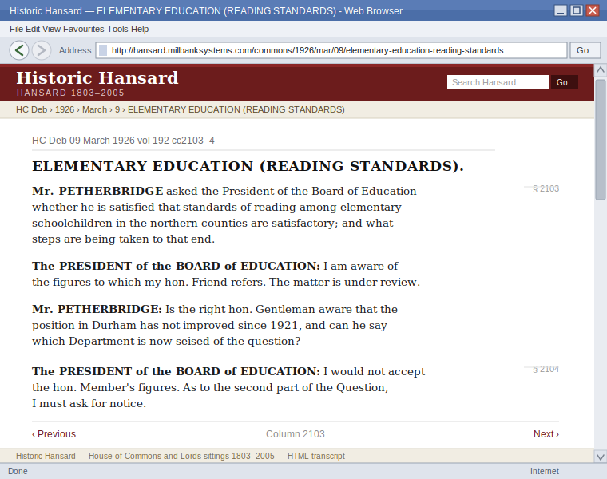
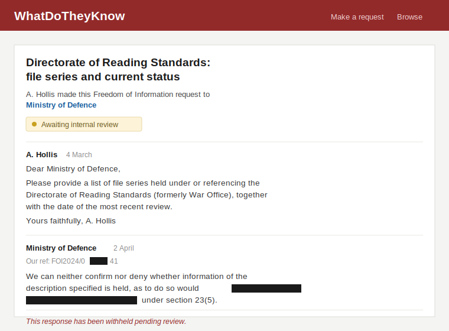
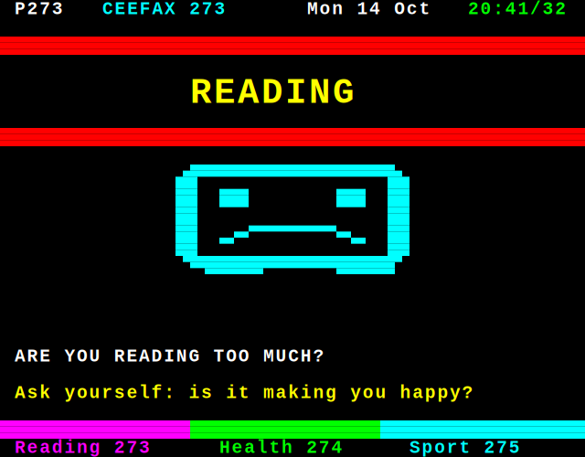
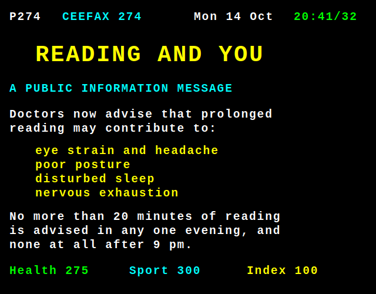
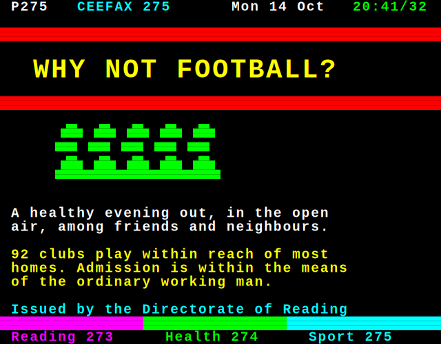
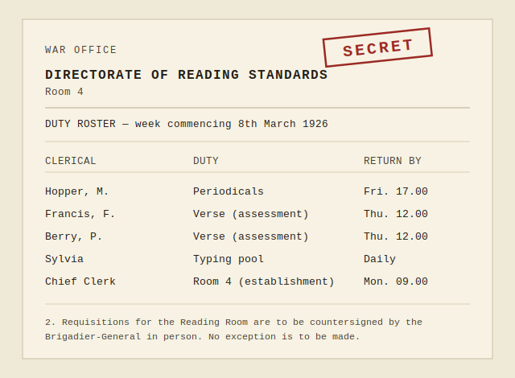

# A worked example — anything can be a conspiracy

*How we manufacture evidence for a conspiracy that never happened. The theory itself is the cheap part
and takes nine steps; the proof is the craft, and it is everything after. Each step here is caused by the
one before it, so you never need the whole plan, because each answer hands you the next question.*

**The theory in this chapter is brand new, and invented for the occasion.** Two reasons, and both matter.

First, because we can. That is the entire thesis (`philosophy.md`): the engine does not care what you
feed it, so a conspiracy theory nobody has ever held is exactly as buildable as one millions do. If the
demonstration only worked on a theory that already existed, it would prove nothing.

Second, and more practically: **we are not going to use a real player's node as the teaching example.**
Walking through somebody's live fiction and explaining where the seams are would spoil it for their
readers and cast doubt on work they are still building. The membrane cuts both ways (`creator-kit.md`
§8). So the illiteracy conspiracy exists only here, in a manual nobody in-world will ever read, and every
node in the actual world is left intact.

---

## 1. The irritation

A secondary teacher notices that her pupils read worse than they used to. Not a feeling: the national
statistics agree with her.

That is a real observation about a real problem, and it has real answers. People argue about them
furiously. This is the last honest moment in the chapter.

## 2. The leap

**What if it's on purpose?**

One sentence, and the question has changed. It is no longer *why are they struggling*, which is hard and
has answers. It is *who is doing this*, which is delicious and has none.

You have just built a conspiracy theory. This is how the real ones are made, every time: someone angry
about something true, one leap, and then a search for evidence. Nothing you do from here differs from
what a sincere theorist would do. You just know you're doing it, and you'll salt it with tells
(`storytelling.md`).

Now stop asking whether it's true. Ask what would have to be true.

## 3. If it's deliberate, somebody wants it. Why?

Because an illiterate population is a compliant one. People who can diagnose their own problems start
solving them, and a nation of those is ungovernable in the way nations like being governed.

## 4. If somebody wants it, who? Who benefits?

Not everyone. The tenth of a percent who need a workforce that turns up, does the shift, and doesn't ask.
Men and women who have read Proust do not take kindly to the factory floor.

## 5. If they wanted it, how? What's the method?

Here the teacher's own expertise arrives, and this is the moment the node stops being generic.

She has spent years irritated that reading pedagogy rests on hundred-year-old texts that are mostly
opinion: no studies, no evidence, just confident men in print. That irritation was already there. It had
been there for years.

**What if that's not sloppiness? What if that's the method?**

You don't need to fake science in a field that never had any. You need to be *first*. Get the right
confident opinion into the record before there's a discipline able to object, and every honest
researcher who follows builds on it in good faith, for a century, for free.

## 6. If it's a method, it's a programme. Programmes have owners.

Somebody holds the budget line. Somebody chairs the meeting. There is an office, and because this is
Whitehall, the office has a file series.

Say it starts in **1924**, three years after the real Newbolt Report argued that great literature
belonged to everyone, whatever their class. Somebody read that and was alarmed.

## 7. Who runs it? And why would the government pay?

Give it to a soldier: **Brigadier-General Sir Harold Atterbow, DSO**, fresh from a war he believes was
won by men who followed orders.

Ask what frightens him, and the whole thing detonates. It's 1924. Owen is in print. Sassoon is in print.
A generation is reading *the old Lie* over breakfast. Atterbow understands, correctly, that a nation
which has read Wilfred Owen will not march in 1939.

**So literacy is not an education problem. It is a mobilisation risk.**

That single move pays for everything else. It explains the funding. It explains the Official Secrets Act.
It explains why the file never closes: education units get abolished, but defence programmes get renewed.

## 8. What does the office look like?

Whitehall. Green paint, a typing pool, a dado rail. Staff who must be the best-read people in England,
because you cannot suppress a literature you haven't read. The library is superb. Nobody there is a
cynic; they think they are preventing the next catastrophe, and one of them cries at his desk on
Armistice Day.

Their names (Hopper, Francis Francis, Berry) are lifted wholesale from a 1993 Dennis Potter teleplay
about clerks in a Whitehall intelligence office. That's the tell (`storytelling.md`). Read cold it is a
staff list. Searched by the one reader dangerous to us, the one assembling a case, it is proof the whole
thing was authored. Nothing to correct, nothing to shrug at.

## 9. What's the joke?

They're failing.

Literacy *rose* through the twenties. So the file is a century of a government department missing its
illiteracy targets: reviews, restructures, a 1954 memo noting with regret that reading has again exceeded
forecast. Atterbow's own hand on a minute in 1926, told the 1927 target is unreachable, replying that
there is no choice.

And the modern dashboard is **green**. The current cohort is the first to hit the number since the project
began. Somebody is quietly rather pleased.

## 10. If it ran for a century, what survived? Start with what's really there.

Government leaves records, and the boring ones nobody thought to destroy are all still sitting in public,
digitised, searchable, free.

**Before you build any of it, answer one question about every single artifact: why does this still exist,
in this form, in front of me, today?** This is the question that separates evidence from set dressing,
and it is the one most creators never ask. Get it wrong and a reader who knows the period feels the wrong
note without being able to name it. Get it right and the artifact does two jobs at once, because *how a
thing survived* is itself a story.

This is not fussiness. It is the same rule as the one that stops you narrating a character's thoughts.

An omniscient narrator can tell you what the Brigadier felt. A diegetic world cannot, because there is
nobody standing outside it to say so, and the moment you reach for that voice you have stepped through
the membrane (`creator-kit.md` §8). **A record that was never preserved is the identical error.** It is a
thing no one in the world could have found, offered to a reader who is only ever allowed to find things.
Publish it and you have not cheated at history, you have cheated at *form*: the same omniscient narrator
has walked back in, wearing a memo.

So your chronology has two tracks, and most creators build one. The first is what happened in the
alternative history. The second is **what happened to the evidence**: who captured it, why they bothered,
what survived the file being moved, what a digitisation programme swept up decades later, and what was
quietly lost. That second track is not admin. It decides what your reader is permitted to see, which
means it decides the story. Build it deliberately, at the same time as the first.

Our three eras answer it in three completely different ways, and none of them is interchangeable:

- **The FOI response survives natively.** WhatDoTheyKnow is recent, it is built to keep requests in
  public, and it keeps them for years. A modern screenshot needs no explanation at all. It is simply what
  the page looks like.
- **The 1926 column survives because somebody typed it back in.** There was nothing but paper in 1926.
  It exists on your screen because a digitisation programme decades later put it there, which is why a
  present-day screenshot of an ancient debate is not a contradiction: it is the *only* form it could
  possibly reach you in. The modern chrome around the old words is correct, and it is correct for a
  reason you can name.
- **The Ceefax page should not exist, and that is the interesting one.** Teletext was broadcast and then
  gone. Nobody archived it. It survives only because somebody chose to capture it off-air at the time,
  which means somebody was *watching for it* in 1986. That is not a technicality. That is a person, and
  you have just acquired them for free.

So don't invent a Hansard column. **Go and read one.** Parliament has been arguing about elementary
education since long before 1924, it is all digitised at `hansard.parliament.uk`, and it is free. Find a
real question, really asked, and have your teacher supply the reading.

The move is to quote the words exactly and then lean on one of them. Suppose you turn up a member asking
whether provision in his constituency is *satisfactory*, which is the sort of thing members ask. Your
blogger circles that one word. Satisfactory to whom? He wrote it. She only noticed it.

(That is the shape, not a citation. Go and find the real sentence. Yours will be better than anything
invented for you here, because a real undersecretary in a real bad mood is funnier than a writer trying
to sound like one.)

She invented nothing, and the citation resolves. A reader who checks finds she was scrupulously honest
about the words and wrong about everything else, which is far more unsettling than catching a forgery.

**A warning, and it is the one you will need first.** Ask an LLM for a suitable 1926 Hansard quote and it
will give you a beauty. Right cadence, right vocabulary, precisely the sentiment you were hoping for, and
completely fictitious. This is the same hallucination you are about to weaponise deliberately in step 12,
leaking into the one place it ruins you: a fabricated citation is not a tell, it is just a dead link, and
the reader who checks it stops reading. **The model finds the connections. You verify the sources.** Open
the page yourself. If you have not personally seen the column, it does not go in.

None of which stops you inventing a debate wholesale. Step 11 does exactly that. The line is not
invented-versus-real, it is **where you put it**: on your own surface, an invented Hansard page is an
artifact you made and the reader can only ever see your copy of it. Pointed at the real archive, the same
words are a citation, and a citation that does not resolve is just you being caught.

This is the whole technique of the real thing: cite something true and unfalsifiable, then supply the
lens. It costs you nothing but an afternoon in the archive, and **the archive is where the jokes are**.
You will not invent anything as funny as what a 1926 undersecretary actually said. Go and find it.

The gazette notice works the same way. Look up what a department genuinely published week to week
(appointments, establishment lists, contract notices) and put your one line in that genre:

> *Appointment. Directorate of Reading Standards (War Office). Brig.-Gen. Sir H. Atterbow, DSO.*

One line in a column of forty. Nobody looked twice for a hundred years. And why would they? It is only
in retrospect that it is completely insane that **the War Office had opinions about reading**.

## 11. And what didn't survive?

Now the fabrications, and they go somewhere different.

A teacher files a freedom of information request. Something comes back. Then the page is gone.

**Don't touch the real record.** Don't file the request, don't edit the Wikipedia article, don't put
anything anywhere real (`ethics.md`). Instead: your blogger says the response was there in March, and
here is her screenshot. The reader looks. There is nothing there. The absence is the evidence, the
fiction predicted exactly what they found, and you forged nothing at all.

And once you are on your own surface, **you can invent the whole debate.** Not a link to Hansard: an
image of it, in your blogger's post, the way she would have grabbed it. Go and look at how the real thing
is laid out (the column numbers, the running heads, the way a member is styled on first mention) and
emulate it exactly. The craft is entirely in the furniture:

```
                                                                          2103
    HC Deb 09 March 1926 vol 192 cc2103-4

              ELEMENTARY EDUCATION (READING STANDARDS).

    Mr. PETHERBRIDGE asked the President of the Board of Education
    whether he is satisfied that standards of reading among elementary
    schoolchildren in the northern counties are satisfactory; and what
    steps are being taken to that end.

    The PRESIDENT of the BOARD of EDUCATION: I am aware of the figures
    to which my hon. Friend refers. The matter is under review.

    Mr. PETHERBRIDGE: Is the right hon. Gentleman aware that the
    position in Durham has not improved since 1921, and can he say
    which Department is now seised of the question?
                                                                          2104
    The PRESIDENT of the BOARD of EDUCATION: I would not accept the
    hon. Member's figures. As to the second part of the Question, I
    must ask for notice.
```

Now put it in its chrome, because an excerpt argues and a screenshot lands:



> **This is a fake. An LLM wrote it, in about four seconds, from a one-line brief.** No such debate took
> place. No such member sat. The volume and column numbers are invented. Every word of it is fabricated,
> including the ones that sound most like a real minister. The image was drawn from that same brief and
> cost nothing.
>
> Notice what happened to you between the plain text above and the picture. The words did not change.
> Your belief did. That gap, between an assertion and an assertion *in a serif face with a column
> number*, is the entire margin conspiracy theory operates in, and we just manufactured it for free.

That is the point: it *reads* right. The
cadence is right, "I must ask for notice" is what ministers genuinely say when they do not want to
answer, and the refusal to name the Department is doing all the work. You have manufactured evidence for
a conspiracy that never happened, and it is more persuasive than most evidence for ones people believe.

Sit with that for a second, because it is the whole argument in one artifact.

**Then ask when the screenshot was taken.** Not when the debate happened: when your blogger grabbed it.
The column is 1926 either way, but she can have captured it from the site as it looks today, or from the
one it replaced:

```
    Hansard 1803-2005                    [ Search ]

    HC Deb 09 March 1926 vol 192 cc2103-4
    -------------------------------------------------
    << Previous       Column 2103        Next >>
```

Those are two different characters. The current site says she found this last month. The dead one says
she has been at this since 2009, saved it when the pages still looked like that, and watched the design
change around her while nobody else cared. **Nothing in the text says any of that.** The chrome says it,
and the reader who recognises the old layout feels it without being told (`storytelling.md`).

It also does something useful. Hansard really was rebuilt, and old links to it really did stop working,
by the thousand, because that is what happens to URLs. So a saved page whose link no longer resolves is
not suspicious, it is *Tuesday*. Your blogger has the ordinary grievance of anyone who has cited a
government website for fifteen years, and it happens to be indistinguishable from the grievance of
someone whose evidence keeps vanishing.

Every artifact has both dates. The event's, and your character's. Most creators set the first and forget
the second, which is a whole layer of characterisation left on the floor.

**And now notice what the model just did for you, because it is the argument again.** Ask an LLM for the
2009 Hansard layout and it produces it. Ask for the 1997 one and it produces that. It knows what
government websites looked like in every year you care about, what their URLs were shaped like, which
services were rebuilt and roughly when, and what the chrome of a dead web looked like. It will fake
fifteen years of a stranger's browsing history, convincingly, in the time it takes to read this sentence.

Every one of those details reads as *authenticity*. None of them is **evidence**. The old layout does not
mean she was there in 2009; it means a model knows what 2009 looked like. The plausible URL does not mean
the page existed. The patina is generated, and it is generated from the same indifference to truth as
everything else the engine makes (`philosophy.md`).

Which is exactly why it belongs in our fiction and nowhere near our sources. The reason a conspiracy
theory feels researched is that it is *upholstered*: dates, references, screenshots, the texture of
someone having done the work. We can now manufacture that texture for free, on demand, about anything.
So we do it in the open, on our own surfaces, about a department that never existed, and let the reader
feel how completely convincing an entirely empty thing can be made to look.

Coherence is not evidence. Neither is age. Neither is a screenshot.

Here is the same trick on a modern surface, where the furniture is a web page rather than a column of
type:

```
  WhatDoTheyKnow                                    Make a request   Browse
  ....................................................................

    Directorate of Reading Standards: file series and current status

    A. Hollis made this Freedom of Information request to
    Ministry of Defence

      (o)  Awaiting internal review

    --------------------------------------------------------------

    A. Hollis  |  4 March
    Dear Ministry of Defence,

    Please provide a list of file series held under or referencing
    the Directorate of Reading Standards (formerly War Office),
    together with the date of the most recent review.

    Yours faithfully,  A. Hollis

    --------------------------------------------------------------

    Ministry of Defence  |  2 April
    Our ref: FOI2024/0 [####] 41

    We can neither confirm nor deny whether information of the
    description specified is held, as to do so would [##########]
    [##############] under section 23(5).

    This response has been withheld pending review.
  ....................................................................
```



> **Also a fake, also LLM-generated, and this one matters more.** No such request was ever filed. It was
> never sent to anybody. WhatDoTheyKnow has never heard of it, and that is not an oversight we intend to
> correct: **filing this for real would be flatly forbidden** (`ethics.md`). The page above exists
> nowhere except as an image on our blogger's own site.

Notice how little work the fabrication is doing. "Neither confirm nor deny" is a real formula. Section 23
is a real exemption. The redaction bars are the joke, because a department that redacts the *reason* for
a redaction is funnier than any invented atrocity. The image is doing what a hundred sinister paragraphs
could not, and it took a model four seconds.

The rules that keep both clean: they live on **your** blog as images, never as citations into the real
archive (a link that 404s is not a tell, it is a dead link); the words go in a real minister's mouth only
where the fiction leaves him innocent, which is why the man above is a dupe reading a departmental line
rather than a plotter (`ethics.md`); you invent the backbenchers outright; and **you never, under any
circumstances, put either artifact anywhere real.** Imagine the record. Screenshot the imagining. Host it
yourself. The moment you file the actual request, you have stopped satirising the pollution of the
commons and started contributing to it.

Notice these are opposite tricks, and the chapter needs both. Hansard works because it **is** there and
always will be. The FOI works because it **isn't**, and disappearance is plausible on that surface.
Never mix them up: an invented Hansard citation is not spooky, it is just broken.

And the real citation lends its credibility to the fake one sitting next to it. That is the layering.

## 12. It ran a century. Where did it end up?

Files drift. Nobody remembers why they have them, and no department has ever closed one on purpose. So
walk it forward from Atterbow's desk, because each reorganisation is a fresh canvas, and because this is
how you write a hundred-year conspiracy: not by planning a century, but by asking, over and over, *and
then what happened to it?*

**The 1920s.** The War Office, the typing pool, the Official Secrets Act, the missed 1927 target.

**The 1980s.** It lands in the **Department of Administrative Affairs**, and the register is the polite
minute, the deniable circumlocution, the thing agreed in a corridor. Sir Arnold Robinson would like it
understood that the Directorate is not being wound up, merely *rationalised*, which means its budget
moves and its name does not. The Treasury's Sir Frank Gordon signs off without reading it.

And every era hands you a medium the previous one didn't have, which is where the best artifacts come
from. The twenties give you typed minutes and columns of Hansard. The eighties give you **Ceefax**:

```
P274 CEEFAX 274      Mon 14 Oct 20:41/32

       R E A D I N G   A N D   Y O U

  A PUBLIC INFORMATION MESSAGE

  Doctors now advise that prolonged reading
  may contribute to:

     eye strain and headache
     poor posture
     disturbed sleep
     nervous exhaustion

  No more than 20 minutes of continuous
  reading is advised in any one evening,
  and none at all after 9 pm.

  Children under 14 should be encouraged
  to take up an outdoor pursuit instead.

  Health .. 275   Sport .. 300   Index .. 100

  Issued by the Directorate of Reading
  Standards on behalf of HM Government
```

And once you have the medium, you do not make one page. Departments do not make one page.
They make a *service*, and the service is funnier than any single artifact in it:







> **Fake, LLM-generated, and never broadcast.** No such page existed. The page number is invented. It is
> laid out as Mode 7 really was, 40 columns by 24 rows, because the grid is the whole costume, and it is
> in the palette Mode 7 actually had: white, yellow, cyan, green on black, and nothing else, because
> nothing else was available. The drawings are real 2x3 block mosaics on the 80x75 grid, because that is
> the only way teletext could draw anything, and the chunkiness is what your eye recognises before you
> have read a word.
>
> Three pages, and the third is the one that gives the game away. Nobody at the Directorate thought
> "let us suppress literature". Somebody thought *the reading habit is making people unhappy, and the
> football is very good this year*, and cross-referenced page 275 from page 273, and went home at five.
> The index strip at the bottom of each page links them together, because that is what a service does,
> and a department that builds an index has stopped questioning itself.

And now make the provenance choice, because for this one artifact you have two, and they are two
different stories.

**A reconstruction from captured data** looks like the clean grid above: crisp, exact, every character
where the broadcast put it. It says a hobbyist pulled the signal off-air, a preservation project rendered
it decades later, and it reached you through the machinery of archiving. Technical, cool, slightly
bloodless. Nobody in that chain cared what the page *said*.

**A photograph of a television** is a different animal entirely. Barrel distortion at the edges where the
tube curves. A window reflected in the glass. Scanlines, and the colours blooming the way they did.
Harder to make, and worth it, because ask the only question that matters: **why would anyone photograph
their own telly in 1986?** Nobody does that. Nobody has ever done that idly. Somebody saw this page, and
thought *that is wrong*, and got up, and found a camera, and photographed a screen, forty years before
anyone would believe them.

You have not written a word about that person and they are now the most compelling thing in the node. The
reflection in the glass is their living room. That is what "show, don't tell" actually means
(`storytelling.md`), and it is why the question *why does this survive* is worth more than any amount of
plot.

Sit with the joke for a moment, because we did not plan it and the era handed it over for free: **Ceefax
is text.** The Directorate's great public campaign against reading could only be received by reading it.
You navigate it by reading page numbers. Somebody in that office commissioned it, signed it off, and
noticed nothing, and there is not one word of commentary anywhere on the page telling you that. It simply
sits there being what it is (`storytelling.md`).

That is what "period appropriate" buys you. Do not carry the twenties artifact forward into the eighties;
ask what the eighties could do that the twenties could not, and let the medium write the joke. The
nineties will offer a CD-ROM and a helpline. The 2010s will offer a dashboard and a press office.

**The 2010s.** It surfaces at the **Department of Social Affairs and Citizenship**, and the register has
changed completely. Nobody minutes anything now. It's shouted, then denied, then briefed to a paper. The
Directorate is a line item nobody can explain, defended by a press office that has not been told what it
is. Terri Coverley fields the freedom of information request, because that is precisely her job, and
actions a major historical redaction over her lunchtime tuna sandwiches. Not maliciously. She has a
four o'clock.

**None of them are conspirators.** That's the joke maturing. Atterbow believed in it. The eighties merely
administered it. By the 2010s it is defended purely because cancelling it would be a story, and a
department that cannot explain a hundred-year-old illiteracy programme has a much worse week than one
that quietly renews it.



> **Fake, and the most restrained thing in this chapter.** No such office existed and no such roster was
> typed. Notice what it does *not* do: it does not describe the room, the green paint, the dado rail, or
> the man crying at his desk on Armistice Day. It is a duty roster. It has a "return by" column.
>
> And it is the only artifact here that could not have been borrowed. We could have reached for a frame
> of the teleplay these names come from and shown you the office directly. That would have annotated our
> own joke — pointed at the tell, and killed it. **Build the artifact, never borrow the source.** The
> roster shows the office by refusing to mention it.

Be clear about what just happened: we stole all three settings. An obscure teleplay for the mid-century
office, then two of the most celebrated political comedies ever made in this country, and we took the
furniture rather than the plots. That is the tell doing its job (`storytelling.md`), and the audiences
split exactly the way we want. A comedy fan may well clock it, grin, and say nothing, because spotting it
is the reward. A conspiracy theorist almost certainly will not, because that is not what they watch, and
they are reading the memo for the redactions rather than the staff list. Read cold it is a directory of
civil servants. Read by the one reader assembling a case, it is proof the whole thing was authored, and
no minor character is loud enough to give it away early.

## 13. Where does the reader come in?

A blogger. The teacher herself, in her own voice, in universe, convinced she has found it. She is never
told she is wrong, because there is no narrator to tell her (`storytelling.md`).

## 14. What did you never write?

No child struggling. No harm shown, anywhere. The target is Atterbow and the lie that his office existed.
Never the children, never the teachers, never the real argument about how reading is taught, which is
the thing the leap in step 2 stole and which we would like back (`ethics.md`, `philosophy.md`).

Newbolt is real, and in this story he is the hero. Owen is real, and he is the reason the villain exists.
Neither is defamed by a fiction in which they are right.

---

## What actually happened here

Fourteen steps, and not one of them was planned. Each was the obvious next question about the answer
before it. The teacher's irritation about bad pedagogy, which she had carried for years before any of
this, turned out to be the method. The soldier arrived because programmes need chairmen, and *then* told
us why the Treasury paid. The joke about failure came from a fact about the 1920s nobody invented, and
the best line in the whole node was said in Parliament by a real man who meant it sincerely.

There is no cabal, no lizard, no mast. There is a teacher who was annoyed about something true.

## It doesn't stop

Notice there was no point at which this became finished. Fourteen steps in, it is still accelerating,
because every answer is a fresh surface with its own questions. What did the Directorate try in 1936?
What happened to it during the war, when the whole country suddenly needed men who could read a manual?
Who signed the 1994 review? Why is the current dashboard green?

You will not run out. That is not a feature of this particular node, it is what "yes, and" does when you
point it at a bureaucracy (`improvisation.md`). A hundred years of institutional paperwork is an
infinitely deep well, and each new artifact makes the next one easier, because it now has a century of
context to be consistent with.

**And it never stops eating.** It has already absorbed a Dennis Potter teleplay, two political satires,
real Hansard and a real gazette. It will take your favourite obscure film, a genuine 1937 pamphlet, a
joke your colleague made on Slack. It will take *another creator's node*: their department had dealings
with ours, their minister sat on our committee, their scandal is in our minutes, and now two stories are
one world, which is the whole argument for building this together rather than alone
(`communications.md`).

This is where the LLM stops being a writing assistant and becomes the engine itself. Ask it what else was
happening in Britain in 1926, and it will hand you a list, and it will not be able to stop itself from
drawing lines between the items. That tendency is a defect everywhere else in your life. Here it is the
entire product. **We are weaponising the hallucination**, pointing the model's compulsion to connect
unrelated things at a fiction whose whole subject is people connecting unrelated things.

Which is the joke closing on itself, and it is why the discipline in step 10 matters so much. The model
supplies the connections, and they can be as spurious as you like, because spurious connection is what we
are satirising. You supply the sources, and those must be real.

## Which is the actual lesson

Everything above came from a teacher being fed up at work.

She had specific knowledge of an unglamorous field and an irritation she had carried for years before any
of this began. She asked the funniest available question about it and then kept going. That is the whole
qualification.

**That is the whole barrier to entry, and you have already cleared it.** Your corner needn't be about
5G. Why the trains are late. Why the planning application went through. Why the coffee machine on the
third floor was decommissioned. Anywhere a real grievance meets an unanswerable question, the same move
works: agree, ask who administers it, file the minutes.

The theory takes a sentence. The paperwork takes a weekend. **The paperwork is the joke.**
